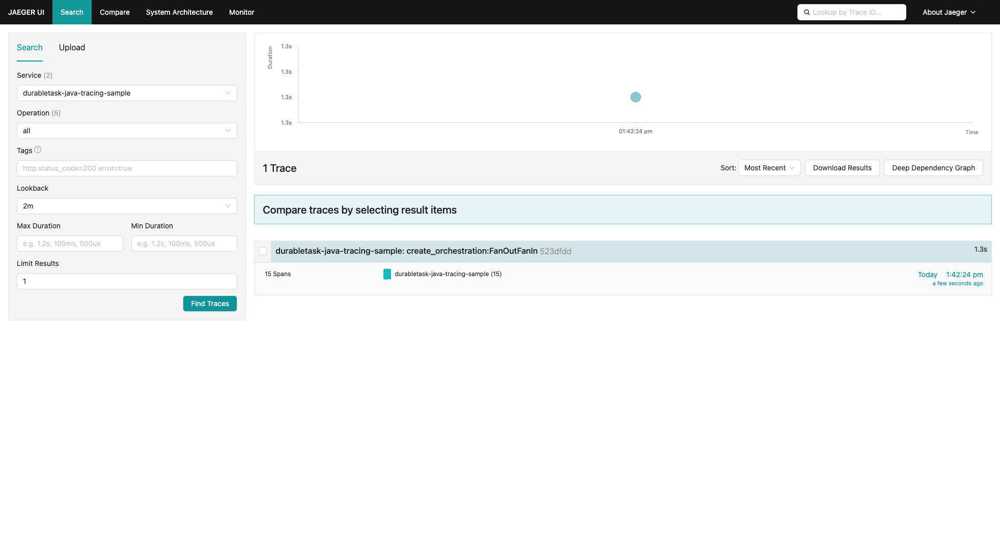
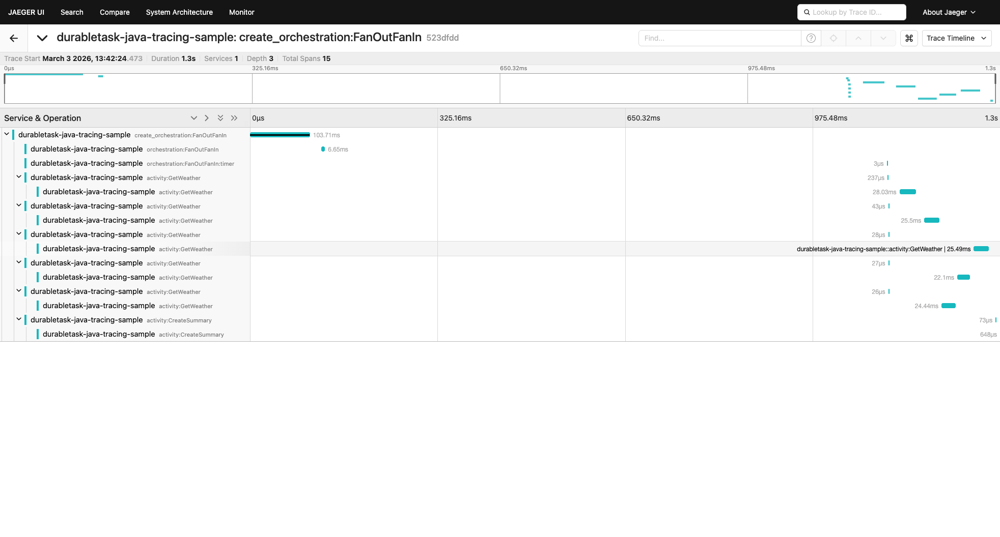
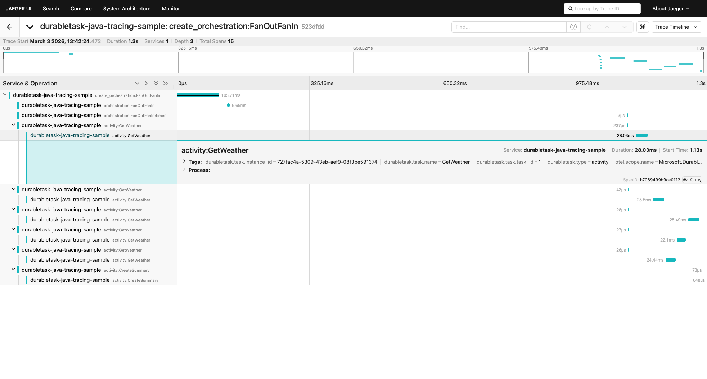
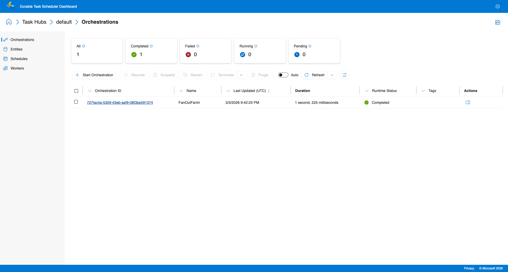

# OpenTelemetry Distributed Tracing Sample

This sample demonstrates distributed tracing with the Durable Task Java SDK using OpenTelemetry. Traces are exported to Jaeger via OTLP/gRPC for visualization.

The Java SDK automatically propagates W3C trace context (traceparent/tracestate) when scheduling orchestrations. The worker creates spans around each activity and orchestration execution, forming a correlated trace tree visible in Jaeger.

## Prerequisites

- Java 17+
- Docker (for DTS emulator and Jaeger)

## Running the Sample

### 1. Start the infrastructure

```bash
# Start the DTS emulator (port 8080 for gRPC, 8082 for dashboard)
docker run -d --name dts-emulator \
  -p 8080:8080 -p 8082:8082 \
  mcr.microsoft.com/dts/dts-emulator:latest

# Start Jaeger (port 16686 for UI, 4317 for OTLP gRPC)
docker run -d --name jaeger \
  -p 16686:16686 -p 4317:4317 -p 4318:4318 \
  -e COLLECTOR_OTLP_ENABLED=true \
  jaegertracing/all-in-one:latest
```

### 2. Run the tracing sample

```bash
./gradlew :samples:runTracingPattern -PskipSigning -x downloadProtoFiles
```

### 3. View traces

- **Jaeger UI**: http://localhost:16686 — Search for service `durabletask-java-tracing-sample`
- **DTS Dashboard**: http://localhost:8082

## What the Sample Does

The `TracingPattern` sample demonstrates the **Fan-Out/Fan-In** pattern with distributed tracing:

1. Configures OpenTelemetry with an OTLP exporter pointing to Jaeger
2. Connects a worker and client to the DTS emulator using a connection string
3. Creates a parent span (`create_orchestration:FanOutFanIn`) and schedules an orchestration
4. The orchestration waits on a 1-second **durable timer**, then fans out 5 parallel `GetWeather` activities (Seattle, Tokyo, London, Paris, Sydney), fans in the results, then calls `CreateSummary` to aggregate
5. The SDK automatically propagates trace context through the full execution chain

## Screenshots

### Jaeger — Trace Search Results

Shows the trace from `durabletask-java-tracing-sample` service with spans covering the full fan-out/fan-in orchestration lifecycle.



### Jaeger — Trace Detail

Full span hierarchy showing the fan-out/fan-in pattern with paired Client+Server spans (matching .NET SDK):
- `create_orchestration:FanOutFanIn` (root, internal)
  - `orchestration:FanOutFanIn` (server — orchestration execution)
    - `orchestration:FanOutFanIn:timer` (internal — durable timer wait)
    - `activity:GetWeather` ×5 (client — scheduling) → `activity:GetWeather` ×5 (server — execution)
    - `activity:CreateSummary` (client) → `activity:CreateSummary` (server)

15 spans total, Depth 3 — aligned with the .NET SDK trace structure.



### Jaeger — Span Attributes

Activity span showing attributes aligned with the .NET SDK schema:
- `durabletask.type=activity`
- `durabletask.task.name=GetWeather`
- `durabletask.task.instance_id=<orchestrationId>`
- `durabletask.task.task_id=1`
- `otel.scope.name=Microsoft.DurableTask`
- `span.kind=server`



### DTS Dashboard — Completed Orchestrations

The `FanOutFanIn` orchestration completed successfully with all activities.



## Cleanup

```bash
docker stop jaeger dts-emulator && docker rm jaeger dts-emulator
```
